Assume the command of any European principality during the [Viking Age](https://en.wikipedia.org/wiki/Viking_Age) and dominate your neighbors. You may choose among *eleven* principalities, the rest is controlled by the AI. Each one starts with *10,000* in gold, except for the vikings who start with *40,000* if controlled by the AI.

During each year, the following phases occur:
* **Player Action**: You can choose to
    * *Conquer* an adversary's province. As a prerequisite, you need to own an adjacent province - also including maritime adjacency. Similarly to the [C64](https://en.wikipedia.org/wiki/Commodore_64) game [Imperator](https://www.c64-wiki.de/wiki/Imperator_(Thomas_R._A._Wolf)), the whole adversary army will wait for you in the target province (even they are busy with other activities).
    * *Raid* an enemy (also a remote one) for gold. You need to have more soldiers than the garrison which is half the size of the gold reserves.
    * *Propose* a non-aggression pact that lasts several years.
    * *Do nothing*.
* **Enemy Action**: The AI players do the same - except for raids that they never conduct. If large armies conduct battles, the result might also be a draw, meaning losses on each side and the attacker retreating.
* **Build army**: Buy soldiers for *one gold* each (and no maintenance, yay!). The enemies do so concurrently and invest most of their revenue. A small portion is retained to lure you into raids.

# How to Use

Put the repository into a mounted directory of an *emulated* [Amiga 500](https://en.wikipedia.org/wiki/Amiga_500) and run the script from the shell:
```
execute VikingAge
```

You can also start using the workbench (`info`-files provided).

The game language is *German* - but you only need to know some key words in order to play it.

# Map

This is the starting position. The identifieres of the principalities and provinces are also provided.

| 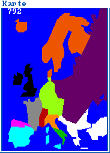 | 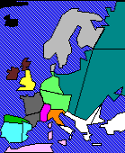 |
| :--: | :--: |
| Principalities in *792* | Province borders |

| 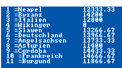 | 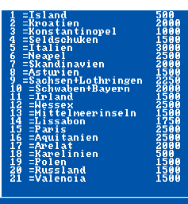 |
| :--: | :--: |
| Army size in *793* | Provincial revenues |

# Sequel

Plans for a sequel including the colonization of Greenland and North America were laid out. However, this project did never move further than the map drawing routine (found [here](src/Wikinger2)).

| 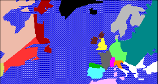 |
| :--: |
| Viking Age II was supposed to extend into North America. |

# Trivia

The source code has been lost in time. Only the [encrypted AmigaBASIC program](https://www.reddit.com/r/amiga/comments/15kc19y/decompiler_for_amigabasic/) is available (in `src-protected`). A memory dump of the program once read comes close to its decrypted but tokenized version - it is found in `src-tokenized`.

There are some anachronisms on the map, notably:
* European principalities reflects the state around *900*.
* The vikings did not start strongly because of their superior numbers but in spite of them.
* The Byzantine Empire's main foe (and distraction) is not on the map.

# Gallery

| 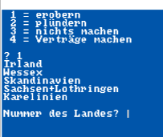 | 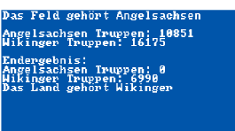 |
| :--: | :--: |
| Eligible attack targets are listed. | Expect that each side's losses are always comparable. |

| 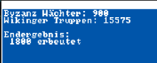 |
| :--: |
| Raid the enemy for his gold |

| 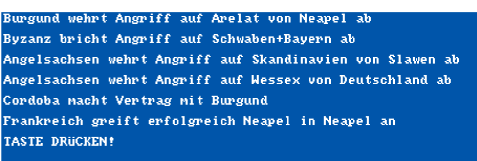 |
| :--: |
| Year-end report about AI activities |

| 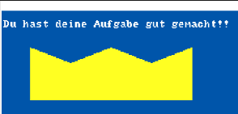 | 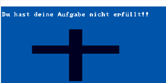 |
| :--: | :--: |
| Win by conquering all the map. | Lose by ceasing to own any province. |
